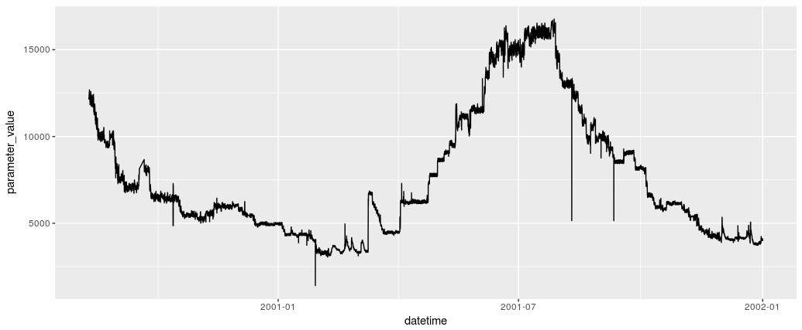

# CDECRetrieve

 [](https://cran.r-project.org/package=CDECRetrieve)


# What is CDECRetrieve?

CDECRetrieve uses the web services provided by the California Data Exchange Center
[here](http://cdec.water.ca.gov/) as a backend to allow users to download 
data with a single function call. CDECRetrieve specifically uses the SHEF download
service due to the fact that it is the most robust of the services. You can learn 
more about the SHEF format [here](http://www.nws.noaa.gov/om/water/resources/SHEF_CodeManual_5July2012.pdf).

Please see the *Details* section below for limitations and possible annoyances 
inherited from the CDEC service.

# Installation 

Install using `devtools::install_github` 

```r 
devtools::install_github("flowwest/CDECRetrieve")
```

# Usage 

## Basic Usage 

CDECRetrieve exposes several useful functions to query services from CDEC. 
The main function in the package is `cdec_query`, 

```r 
# download data from kwk, sensor 20, duration is event type
kwk_flow <- cdec_query("KWK", "20", "E", "2000-01-01", "2002-01-01")
```

The data returned,

```
# A tibble: 17,544 × 5
   agency_cd            datetime location_id parameter_cd parameter_value
       <chr>              <dttm>       <chr>        <chr>           <chr>
1       CDEC 2000-01-01 00:00:00         KWK          20H            5401
2       CDEC 2000-01-01 01:00:00         KWK          20H            4937
3       CDEC 2000-01-01 02:00:00         KWK          20H            5234
4       CDEC 2000-01-01 03:00:00         KWK          20H            5234
5       CDEC 2000-01-01 04:00:00         KWK          20H            5273
6       CDEC 2000-01-01 05:00:00         KWK          20H            5282
7       CDEC 2000-01-01 06:00:00         KWK          20H            5090
8       CDEC 2000-01-01 07:00:00         KWK          20H            5023
9       CDEC 2000-01-01 08:00:00         KWK          20H            5014
10      CDEC 2000-01-01 09:00:00         KWK          20H            5023
# ... with 17,534 more rows
```

Visualize these flows,


```r 
library(dplyr)
library(ggplot2)

kwk_flow %>% 
  filter(parameter_value >= 0) %>% # sentinel values -9998 and -9997 are present
  ggplot(aes(datetime, parameter_value)) + 
  geom_line()
```



*Note that appart from replacing sentinel values with appropriate NA values, 
the package does no QA/QC. This can be seen in the plot above, where suspicoius 
values are apparent.*


# Details 


### Why use shef?

The package uses the shef download service to download the data. It was chosen
for its undocumented ability to download multiple years of data with one call,
something the csv service can not do.

### Time Zone?

All downloaded data is in PST. Data skips 2:00 am on days of daylight saving change.
From the cdec site,

*If you are looking at the data on one of the web display pages, it's in local Pacific time. (PST during the
winter, PDT during the summer). On the text download pages such as queryCSV or querySHEF, it's in PST only.
Also, please be aware that due to architectural issues, the data during the change from PST to PDT and from
PDT to PST may not be correct.*


### Which is correct?

Using the CDEC website to download data we get two following results 
for the same query: 

Shef

```
:  sta yyyymmdd PS DHhhmm /code value
.A DVD 19971231 PS DH2300 /QRH 110
.A DVD 19980101 PS DH0000 /QRH 108
.A DVD 19980101 PS DH0100 /QRH 110
.A DVD 19980101 PS DH0200 /QRH 109
.A DVD 19980101 PS DH0300 /QRH 110
```

csv

```
6911,PST,'FLOW, RIVER DISCHARGE (cfs)'
19980101,0000,110
19980101,0100,108
19980101,0200,110
19980101,0300,109
19980101,0400,110
19980101,0500,108
19980101,0600,107
19980101,0700,108
```

One includes the last measurement before the start date specified, the other does not, 
yet the values are all the same, meaning that one of these is wrong
by an hour. :'( 


