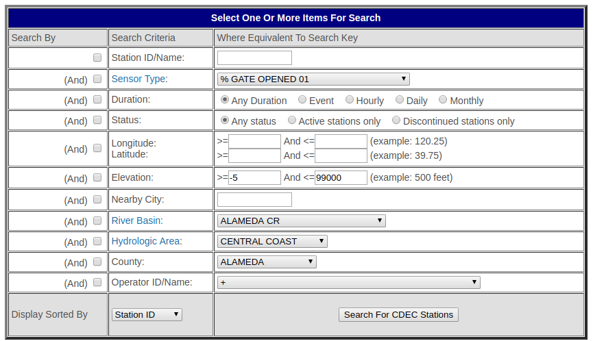

```{r setup, include = FALSE}
knitr::opts_chunk$set(
  collapse = TRUE,
  comment = "#>"
)
```

# Install

You can install CDECRetrieve the usual way, 

```{r eval=FALSE}
# for stable version
install.packages("CDECRetrieve")

# for development version
devtools::install_github("flowwest/CDECRetrieve")
```

# Intro

The goal for CDECRetrieve is to create a workflow for R users using CDEC data, we 
believe that a well defined workflow is easier to automate and less prone to error (or 
easier to catch errors). 
In order to do this we create "services" out of different endpoints available 
through the CDEC site. A lot ideas in developing the package came from using 
`dataRetrieval` from USGS and the NOAA CDO api.


# Exploring Locations 

We start by first exploring locations of interest. The CDEC site provides a web 
form with a lot of options,



The pakcage exposes this functionallity through `cdec_stations()`. Although 
it doesn't (currently) map all options in the web form it does so for the most
used, namely, station id, nearby city, river basin, hydro area and county.
At least one of the parameters must be supplied, and combination of these can 
be supplied to refine the search. 

```{r}
library(CDECRetrieve)

cdec_stations(station_id = "kwk") # return metadata for KWK

# show all locations near san francisco, this returns a set of 
# CDEC station that are near San Francisco
cdec_stations(nearby_city = "san francisco")

# show all location in the sf bay river basin
cdec_stations(river_basin = "sf bay")

# show all station in Tehama county
cdec_stations(county = "tehama")

```


Since we are simply exploring for locations of interest, it may be useful to 
map these for visual inspection. CDECRetrieve provides a simple function to 
do exactly this `map_stations()`.


```{r}
library(magrittr)
library(leaflet)

cdec_stations(county = "tehama") %>% 
  map()
```
